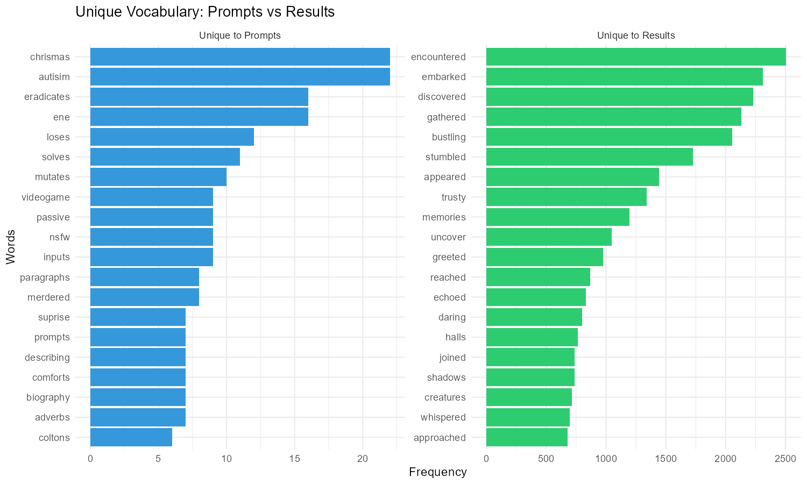
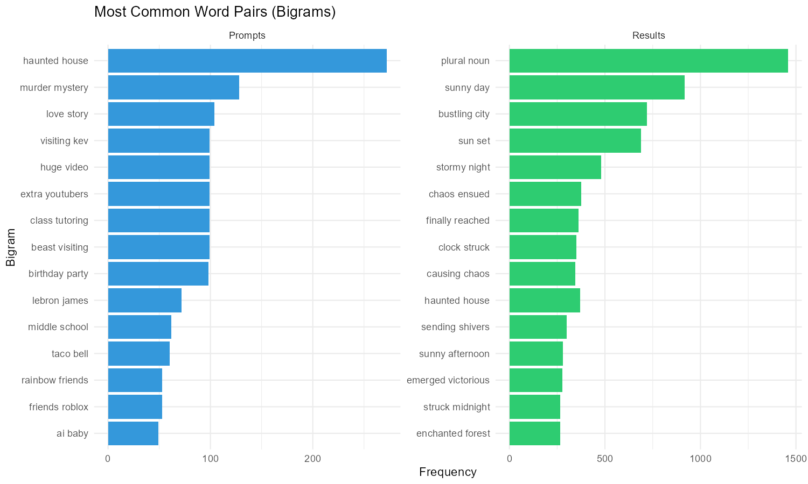
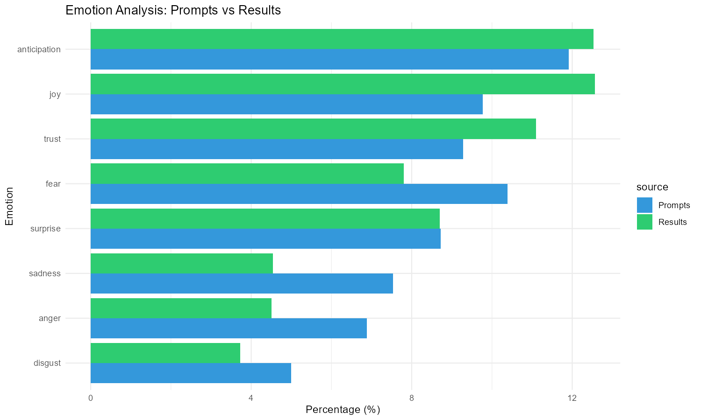
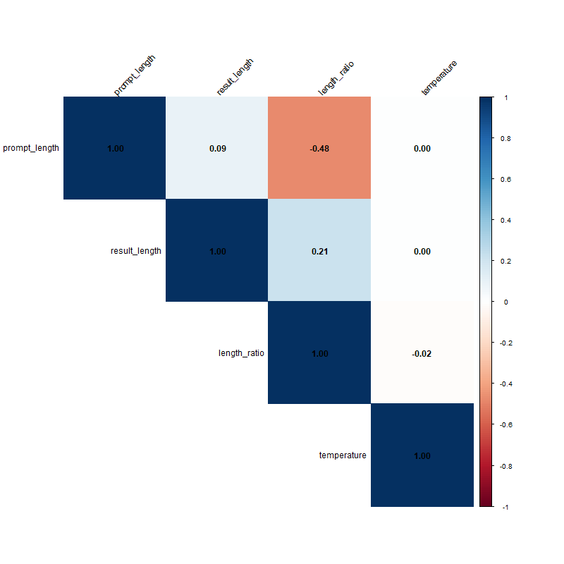
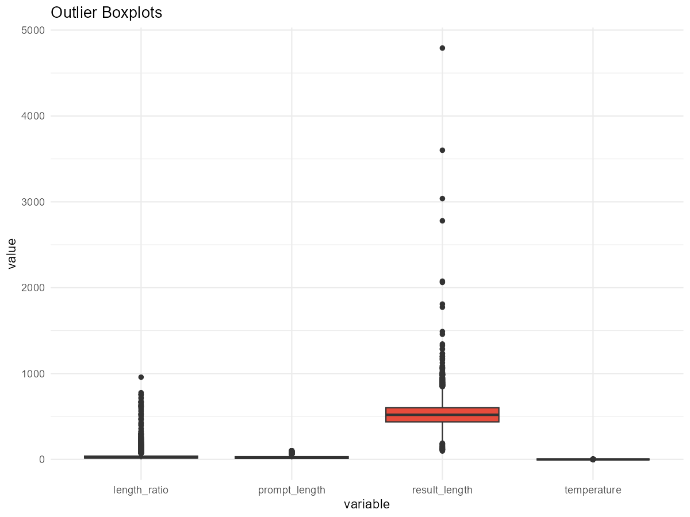
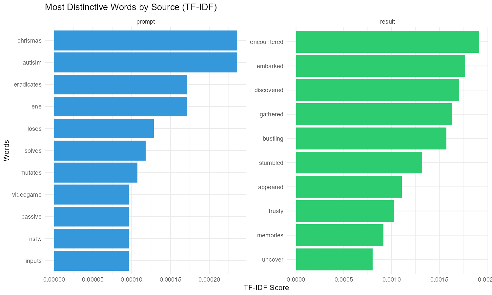

# AI Adlib Data Analysis

This repository contains exploratory and text-focused analysis of AI-generated adlibs, with exported visualizations in `/viz`.

## Visualization Gallery

## Static Visualizations (PNG)

### Unique Word Usage

### Bigram Comparison

### NRC Emotion Distribution

### Correlation Matrix

### Outlier Boxplots

### Top TF-IDF Words

## Interactive Visualizations (HTML)

- [Prompt Word Cloud](viz/prompt_wordcloud.html)
- [Result Word Cloud](viz/result_wordcloud.html)
- [Top Prompt Words](viz/top_prompt_words.html)
- [Top Result Words](viz/top_result_words.html)
- [Length Distributions](viz/length_distributions.html)
- [Sentiment Comparison](viz/sentiment_comparison.html)
- [TF-IDF Heatmap](viz/tfidf_heatmap.html)
- [Pairwise Plot Matrix](viz/pairs_plot.html)
- [PCA Scatter Plot](viz/pca_scatter.html)
- [K-Means Clusters](viz/kmeans_clusters.html)
- [LDA Top Terms](viz/lda_top_terms.html)
- [Word Statistics Table](viz/word_stats_table.html)
- [Dashboard Gauges](viz/dashboard_gauges.html)

## Data Files

Core CSV and database exports are stored at the repository root and can be used to regenerate the analysis in `Madlib.Rmd` and `Madlib-Dashboard.Rmd`.
